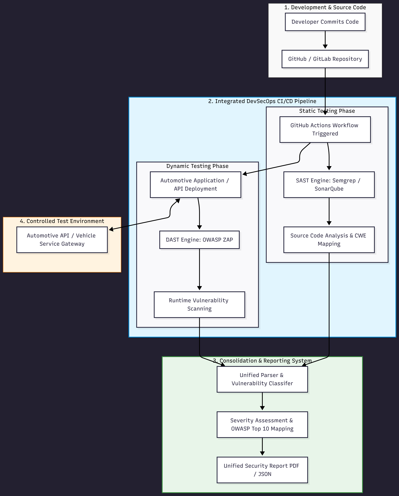
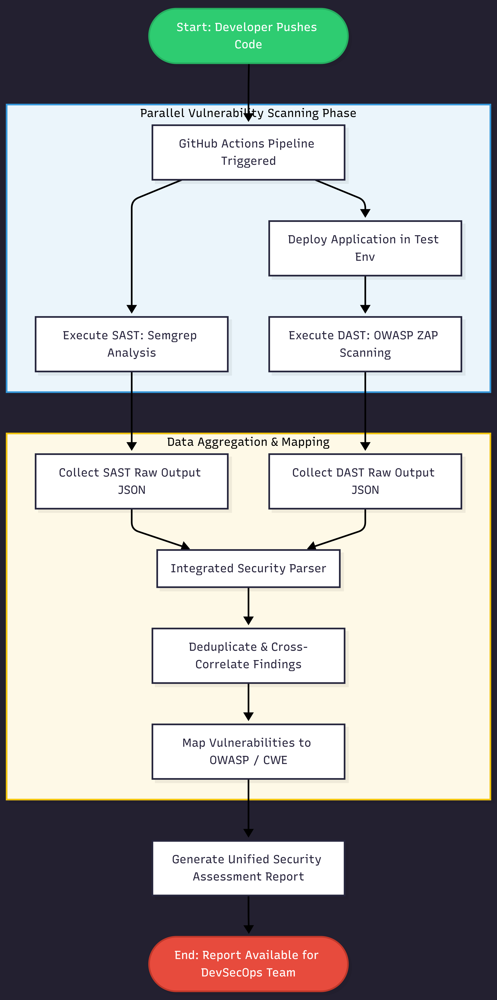

# 03 - System Architecture and Flowchart

**Owner:** Karam Abohadeer (Member 3)  
**Research Area:** Application Security (Automotive Software Systems)

This directory contains the structural architecture diagrams, process flowcharts, and core design methodologies for the proposed Automotive Application Security Testing Framework.

---

## 1. Proposed High-Level Architecture Diagram
The framework integrates SAST (Semgrep) and DAST (OWASP ZAP) engines into a continuous DevSecOps pipeline for microservices and automotive software components.

---

## 2. System Execution Flowchart
Detailed step-by-step processing logic from code commit trigger to automated parser aggregation and vulnerability reporting.

---

## Planned Deliverables & Standards Alignment
* **Proposed System Architecture Diagram:** Integration of SAST and DAST scanning engines within a Secure SDLC environment.
* **System/Process Flowchart:** Detailed pipeline execution from code commit to vulnerability reporting.
* **DSRM Methodology Flow:** Sequential mapping according to Design Science Research Methodology phases.
* **Secure SDLC Workflow:** Alignment with NIST SSDF standards for continuous application security testing.

*All structural diagrams in this directory are synchronized with Chapter 3 of the Research Proposal.*
